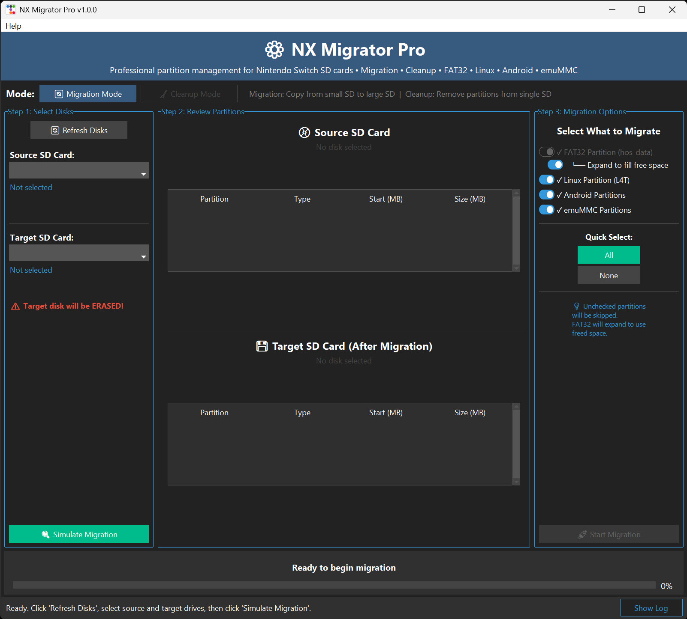

# NX Migrator Pro

A professional partition management tool for Nintendo Switch SD cards with dual-mode operation: Migration and Cleanup.


<div align="center">
  
</div>

## Overview

NX Migrator Pro provides two powerful modes for managing your Nintendo Switch SD card partitions:

### 🔄 Migration Mode
Migrate partitions from a smaller SD card to a larger one with automatic FAT32 expansion.

### 🧹 Cleanup Mode
Remove unwanted partitions (Linux/Android/emuMMC) from a single SD card and reclaim space for FAT32.

## Features

### Supported Partition Types
- **FAT32** (hos_data) - Main Nintendo Switch data partition
- **Linux (L4T)** - Single Linux partition for Lakka/Ubuntu
- **Android** - Both Dynamic (Android 10+) and Legacy (Android 7-9)
- **emuMMC** - Single or Dual emuMMC partitions

### Migration Mode Features
- **Smart Scanning** - Automatically detects partition layout
- **Selective Migration** - Choose which partitions to migrate
- **Auto-Expand FAT32** - Automatically expand FAT32 to use free space
- **Safe** - Source disk is never modified (read-only access)
- **Fast** - Optimized sector-by-sector copying with 32MB chunks

### Cleanup Mode Features
- **Single-Disk Operation** - Works on one SD card (no target needed)
- **Selective Removal** - Choose which partitions to remove
- **FAT32 Preservation** - Backs up FAT32 data temporarily during cleanup
- **Auto-Expand** - Automatically expands FAT32 to reclaim freed space
- **Safe Backup** - Prompts for backup confirmation before proceeding

### GUI Features
- Modern dark-themed interface built with ttkbootstrap
- Visual partition layout display
- Real-time progress tracking with detailed status
- Pre-migration validation and warnings
- Detailed partition information and size calculations

## Requirements

### System Requirements
- **OS**: Windows 10/11 (64-bit)
- **RAM**: 512MB minimum
- **Permissions**: Administrator privileges required
- **Disk Space**: Minimal (application is ~10MB)

### Hardware Requirements
- Source SD Card (your current smaller card)
- Target SD Card (must be larger than source)
- SD card reader(s) - can use one or two readers

## Installation & Usage

### Option 1: Standalone Executable (Recommended)
1. Download `NXMigratorPro.exe` from the [Releases](https://github.com/sthetix/NX-Migrator-Pro/releases) page
2. Double-click `NXMigratorPro.exe`
3. Follow the on-screen instructions

### Option 2: Run from Source
If you want to run from Python source:

1. Install Python 3.8+ from [python.org](https://www.python.org/downloads/)
2. Install dependencies:
   ```bash
   pip install -r requirements.txt
   ```
3. Run as Administrator:
   ```bash
   python main.py
   ```

## Usage Guide

### Mode Selection
Choose your operation mode at the top of the window:
- **Migration Mode** - Migrate from small SD to large SD
- **Cleanup Mode** - Remove partitions from single SD

---

## Migration Mode Usage

### Step 1: Select Disks
1. Insert both source and target SD cards
2. Click "Refresh Disks" to detect SD cards
3. Select your **Source SD Card** (smaller, original)
4. Select your **Target SD Card** (larger, destination)

**WARNING**: Target disk will be COMPLETELY ERASED!

### Step 2: Scan Source
1. Click "Scan Source SD Card"
2. Wait for the scan to complete
3. Review the detected partition layout

The tool will automatically detect:
- FAT32 partition (hos_data)
- Linux partition (L4T) if present
- Android partitions (Dynamic or Legacy) if present
- emuMMC partitions (Single or Dual) if present

### Step 3: Configure Migration
Choose what to migrate:
- **FAT32 Partition** (always migrated, will be expanded to use free space)
- **Linux Partition** (optional)
- **Android Partitions** (optional)
- **emuMMC Partitions** (optional)

### Step 4: Calculate Layout
1. Click "Calculate New Layout"
2. Review the new partition layout
3. Check the comparison dialog showing:
   - Source vs Target sizes
   - How much space FAT32 will gain
   - Free space after migration

### Step 5: Start Migration
1. Click "Start Migration"
2. Confirm the warning dialogs
3. Wait for migration to complete

**DO NOT** remove SD cards or power off during migration!

Migration Progress:
1. Preparing Disk (5%)
2. Copying Partitions (10-80%)
3. Writing Partition Tables (85-90%)
4. Updating emuMMC Config (95-99%)
5. Complete (100%)

### Step 6: Verification
Once complete:
- Safely remove both SD cards
- Insert target SD card into your Nintendo Switch
- Boot normally - all data and partitions preserved

---

## Cleanup Mode Usage

### Step 1: Select SD Card
1. Insert the SD card you want to clean up
2. Click "Refresh Disks" to detect SD cards
3. Select the SD card

### Step 2: Scan SD Card
1. Click "Scan SD Card"
2. Wait for the scan to complete
3. Review the detected partition layout

### Step 3: Select Partitions to Remove
Choose what to remove:
- **Remove Linux** - Delete Linux (L4T) partition
- **Remove Android** - Delete all Android partitions
- **Remove emuMMC** - Delete emuMMC partition(s)

**⚠️ WARNING**: Selected partitions will be PERMANENTLY DELETED!

### Step 4: Review Cleanup Preview
1. Click "Calculate Preview" (happens automatically)
2. Review the "After Cleanup" layout
3. Verify FAT32 expansion size

### Step 5: Start Cleanup
1. **IMPORTANT**: Make sure you have a backup of your SD card!
2. Click "Start Cleanup"
3. Confirm the warning dialogs
4. Wait for cleanup to complete (10-30 minutes)

**DO NOT** remove SD card during cleanup!

Cleanup Process:
1. Backing up FAT32 data (5-35%)
2. Cleaning disk (40-45%)
3. Writing new partition table (50-55%)
4. Creating FAT32 filesystem (60-70%)
5. Restoring FAT32 data (75-95%)
6. Updating configs (97-99%)
7. Complete (100%)

### Step 6: Verification
Once complete:
- Safely remove the SD card
- Insert into your Nintendo Switch
- Boot normally - unwanted partitions removed, FAT32 expanded

## Supported Partition Layouts

### Simple: FAT32 Only
```
[MBR] Partition 0: FAT32 (hos_data)
```

### FAT32 + Linux
```
[MBR] Partition 0: FAT32 (hos_data)
[MBR] Partition 1: Linux (l4t)
```

### FAT32 + emuMMC (Single)
```
[MBR] Partition 0: FAT32 (hos_data)
[MBR] Partition 1: emuMMC
```

### FAT32 + emuMMC (Dual)
```
[MBR] Partition 0: FAT32 (hos_data)
[MBR] Partition 1: emuMMC
[MBR] Partition 2: emuMMC2
```

### Complex: FAT32 + Linux + Android + emuMMC
```
[MBR] Partition 0: FAT32 (hos_data)
[MBR] Partition 1: emuMMC
[MBR] Partition 2: emuMMC2
[MBR] Partition 3: GPT Protective

[GPT] Entry 0: hos_data (FAT32)
[GPT] Entry 1: l4t (Linux)
[GPT] Entry 2-8: Android partitions (boot, recovery, dtb, misc, cache, super, userdata)
[GPT] Entry 9: emummc
[GPT] Entry 10: emummc2
```

## Important Notes

### Before Migration
- Backup your SD card data (recommended)
- Ensure target SD card is **larger** than source
- Use a good quality SD card for target
- Close all programs accessing the SD cards
- Run as Administrator

### During Migration
- **DO NOT** remove SD cards
- **DO NOT** power off your computer
- **DO NOT** cancel the migration
- Wait patiently (30-60 minutes for 128GB, longer for larger cards)

### After Migration
- Verify partition layout in the tool
- Test target SD card in Nintendo Switch
- Keep source SD card as backup until verified working

## Troubleshooting

### "Administrator Required" Error
- Run as Administrator (right-click → Run as Administrator)

### "No SD Cards Found"
- Make sure SD cards are properly inserted
- Click "Refresh Disks"
- Try different USB ports
- Check Device Manager for SD card readers

### "Target disk must be larger"
- Ensure target SD card is actually larger than source
- Some SD cards report slightly different sizes

### Migration Fails
- Check SD card connections
- Try different SD card reader
- Verify target SD card is not write-protected
- Check for bad sectors on target SD card

### emuMMC Not Working After Migration/Cleanup
- The tool automatically updates emuMMC sector offsets in the `raw_based` files
- If issues persist, verify the emuMMC/RAW1 or emuMMC/RAW2 folders contain correct offsets
- Check nx_migrator_pro_*.log for any emuMMC update errors

### Cleanup Mode Specific Issues

**"Temporary backup directory full"**
- Cleanup mode backs up FAT32 data to your system temp folder
- Ensure you have enough free space on your system drive (C:)
- Required space = size of your FAT32 partition
- Alternative: Free up space on C: drive before cleanup

**"Cleanup failed during restore"**
- If cleanup fails during FAT32 restore, your temp backup is still safe
- Check temp folder (C:\Users\YourName\AppData\Local\Temp\nx_partition_backup_*)
- Manually copy files back if needed
- Always keep original SD backup before cleanup!

## Technical Details

### Partition Table Compatibility
- Creates **100% hekate-compatible** partition tables
- MBR for simple layouts (no Android)
- MBR + GPT for complex layouts (with Android)
- Exact same structure as hekate's partition manager
- 16MB alignment for optimal SD card performance

### Android Partition Schemes
**Dynamic (Android 10+):** 7 partitions
- boot (64MB), recovery (64MB), dtb (1MB), misc (3MB)
- cache (60MB), super (5922MB), userdata (variable)

**Legacy (Android 7-9):** 9 partitions
- vendor (1GB), APP (3GB), LNX (32MB), SOS (64MB)
- DTB (1MB), MDA (16MB), CAC (700MB), MSC (3MB), UDA (variable)

## Performance

Migration speed depends on SD card quality and reader:
- **Average**: 30-50 MB/s transfer rate
- **128GB card**: ~45-60 minutes
- **256GB card**: ~90-120 minutes
- **512GB card**: ~3-4 hours

Performance optimizations:
- 32MB chunk size for optimal throughput
- Direct sector-level I/O bypassing filesystem overhead
- Parallel operations where possible

## Contributing

Contributions are welcome! Please:
1. Fork the repository
2. Create a feature branch
3. Make your changes
4. Submit a pull request

## License

GPL-2.0 License - same as hekate bootloader

Copyright (c) 2024

## Credits

- **CTCaer** - Original hekate bootloader and partition manager
- **ttkbootstrap** - Modern GUI framework

## Support

- Open an [issue on GitHub](https://github.com/sthetix/NX-Migrator-Pro/issues)
- Check [existing issues](https://github.com/sthetix/NX-Migrator-Pro/issues) for solutions
- Review this README and troubleshooting section

### Support My Work

If you find this project useful, please consider supporting me by buying me a coffee!

<a href="https://www.buymeacoffee.com/sthetixofficial" target="_blank">
  
</a>

---

Made for the Nintendo Switch homebrew community
